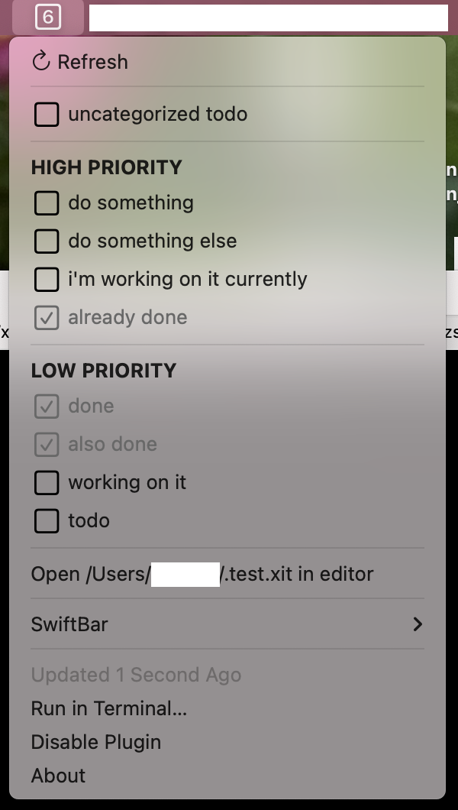
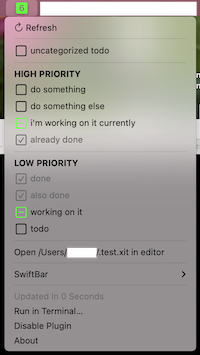

# xit-bar

Swiftbar (https://github.com/swiftbar/SwiftBar) plugin for managing a xit TODO file (https://xit.jotaen.net/)

Requires ruby in your shell environment.

### Setup

Copy or symlink `xit-bar.rb` into your swiftbar plugins directory (possibly `~/.swiftbar`) with the appropriate name for the refresh frequency (e.g. `xit-bar.5s.rb`)

Edit the `EDITOR`/`FILENAME` lines at the top of xit-bar.rb for your preferred editor/file path.

### Usage

Once loaded, the icon will show the number of unfinished tasks (max 50). Clicking will open the menu, showing todos, in groups.

Clicking on a todo will first set it to 'being worked on', then again will 'complete' it. Clicking on a 'done' item will move it back to 'undone'. Any other more complex actions should be done on the file directly in your editor.

If you have any active tasks, the icon will turn green:

